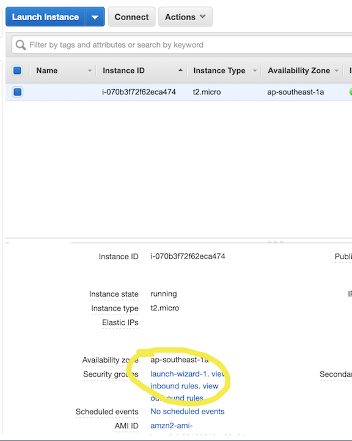
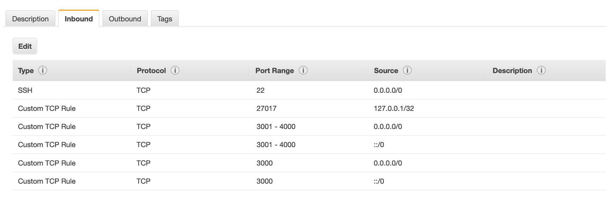

# Beam-me-up
## A project for hacky heroku replacement
### WARNING: This project was made for a school project and is considered extremely insecure by its authors see below for details[^1]

### Requirements
  - AWS account
  - node/npm installed locally
  - github repo with an express server


# Getting started 
In this section we will 
- Created an IAM user that our software can interact with your AWS account through
- Pulled that credential pair down to your local machine
- Cloned down the repo locally
- Installed dependancies
- Launched an EC2 Cloud server
- Configured security groups so that the service would be reachable

## Step by step instructions
  - open AWS account
  - Create an IAM user for programmatic access (the aws-sdk will pull creds from your local computer)
  - leave that window open while you run aws configure from your local development command line
  - from local shell type 
  ```
  aws configure
  ```
  - you will see the following prompt
  ```
AWS Access Key ID [****************ESHN]: 
AWS Secret Access Key [****************Em9v]: 
Default region name [us-west-2]: 
Default output format [text]: 
```
  - enter your access key when prompted and same for your secret access key
  - region should be us-west-2 for this demo
  
  - run from your command line/terminal
  ``` 
  npm i @project-jetpack/beam-me-up -g
  ```

  - **TECH DEBT** make sure the terminate line in app.js is commented out (line 16 app.js)
  - run the node command to create a server from our pre-formatted ami[^1]

  ```
beam-me-up-pem ; beam-me-up-EC2
  ```

  - **TECH DEBT** this may return a DNS name or it may not no biggie
  - Go back to the AWS EC2 console and select the newly launching instance
  - Click the instances checkbox
  - Click on the security group settings (**launch-wizard-1** in this case)
  
  - Click on inbound rules
  - Modify the instances security group rules to match these (port 22 rule is optional)


  - Now you are ready to interact with the service!

# Interacting with the service

- After completing above getting set up steps 
- **TECH DEBT** run 
```
beam-me-up
```
- This will prompt you for a github repo the proper syntax for this entry is[^2]
```
https://github.com/401-midterms-kramer/demo-1
```
- support for .env files right now requires the .env file to be in the same folder from where you run the node command above (path to the command will be different if you are not running it from the root directory of the repo)

- after a short wait you will get back a link to your live site!
- thats it, you have a live website


[^1]: This project uses basic authentication to validate permission against the server. The intention was to make this very easy to interact with for the end user, as a result the code for this repository has credentials hard coded. We ran out of time to automate short term credentials on this project and left a default user with username:password combo of lee:lee. We are well aware of how bad that is.

[^2]: Feel free to fork our example for static websites!